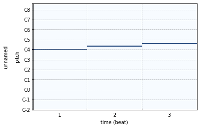
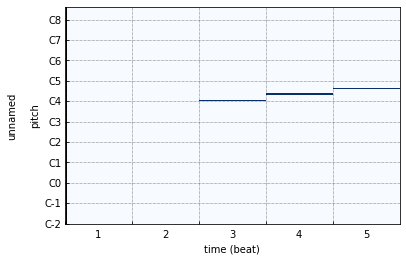
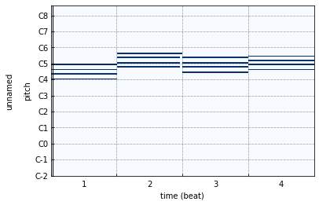

Clip
====
The Clip class is inspired by some DAWs such as Ableton Live and Bitwig Studio.

Initialize
----------

Initialize an empty clip.

    >>> from infmidi import Clip
    >>> Clip()

Initialize with items.

    >>> from infmidi import Note, Clip
    >>> items = [Note('C4'), Note('E4'), Note('G4')]
    >>> clip = Clip(items)
    >>> clip
    Clip(len(notes)=3, len(events)=0, length=1.00)
    >>> clip.notes
    NoteSet([
      Note(name="C4", value=60, freq=261.63, velocity=127, length=1.00, location=0.00, channel=0),
      Note(name="E4", value=64, freq=329.63, velocity=127, length=1.00, location=0.00, channel=0),
      Note(name="G4", value=67, freq=392.00, velocity=127, length=1.00, location=0.00, channel=0)
    ])

Item could be Note、Event or Clip.

    >>> from infmidi import Note, PitchBend, Clip
    >>> item1 = Note('B4')
    >>> item2 = PitchBend(0.5)
    >>> item3 = Clip([Note('C4'), Note('E4'), Note('G4')])
    >>> items = [item1, item2, item3]
    >>> clip = Clip(items)
    >>> clip
    Clip(len(notes)=4, len(events)=1, length=1.00)
    >>> clip.notes
    NoteSet([
      Note(name="C4", value=60, freq=261.63, velocity=127, length=1.00, location=0.00, channel=0),
      Note(name="E4", value=64, freq=329.63, velocity=127, length=1.00, location=0.00, channel=0),
      Note(name="G4", value=67, freq=392.00, velocity=127, length=1.00, location=0.00, channel=0),
      Note(name="B4", value=71, freq=493.88, velocity=127, length=1.00, location=0.00, channel=0)
    ])
    >>> clip.events
    EventSet([PitchBend(pitch=0.50, location=0.00, channel=0)])

NoteSet & EventSet
------------------
The notes and events in ``Clip`` are save in a :class:`NoteSet <infmidi.core.note.NoteSet>` object and  a :class:`NoteSet <infmidi.core.note.NoteSet>` object respectly.

.. note:: 
    The ``NoteSet`` and ``EventSet`` are inherited from `sortedcontainers.SortedSet <https://grantjenks.com/docs/sortedcontainers/sortedset.html>`_.

There are two rules to add ``Note`` to ``NoteSet``.

1. If there is a note in ``NoteSet`` with the same ``value``, ``location`` and ``channel`` as the newly added one, the old one will be replaced.
2. If the existing notes in the ``NoteSet`` overlaps with the newly added one, the lengths of those notes are reduced to eliminate the overlap.

    >>> from infmidi import Note, NoteSet
    >>> ns = NoteSet()
    >>> ns.add(Note('C4'))
    >>> ns
    NoteSet([Note(name="C4", value=60, freq=261.63, velocity=127, length=1.00, location=0.00, channel=0)])
    >>> ns.add(Note('C4', velocity=66, location=5, channel=6))
    >>> ns
    NoteSet([
      Note(name="C4", value=60, freq=261.63, velocity=127, length=1.00, location=0.00, channel=0),
      Note(name="A4", value=69, freq=440.00, velocity=66, length=1.00, location=5.00, channel=6)
    ])
    >>> ns.add(Note('C4', velocity=77, length=3., location=5, channel=6))
    >>> ns
    NoteSet([
      Note(name="C4", value=60, freq=261.63, velocity=127, length=1.00, location=0.00, channel=0),
      Note(name="A4", value=69, freq=440.00, velocity=77, length=3.00, location=5.00, channel=6)
    ])
    >>> ns.add(Note('C4', location=0.5))
    >>> ns
    NoteSet([
      Note(name="C4", value=60, freq=261.63, velocity=127, length=0.50, location=0.00, channel=0),
      Note(name="C4", value=60, freq=261.63, velocity=127, length=1.00, location=0.50, channel=0),
      Note(name="A4", value=69, freq=440.00, velocity=77, length=3.00, location=5.00, channel=6)
    ])

There is one rule to add ``Event`` to ``EventSet``.

1. If there is a event in ``EventSet`` with the same ``__class__``, ``location`` and ``channel`` as the newly added one, the old one will be replaced.

Add & Remove item
-----------------

Time & Pitch shift
------------------

    >>> clip = Clip([Note('C4'), Note('E4') >> 1, Note('G4') >> 2])
    >>> plot(clip)

Using ``>>`` to shift the notes to the right along the timeline.

    >>> plot(clip >> 2)

Scale & Zoom
------------

Concat & Extend
---------------

    >>> clip = chord('C4:M7') | chord('A4:m7') | chord('F4:M7') | chord('G4:7')
    >>> plot(clip)

The following has the same result.

    >>> clip = Clip()
    >>> clip.extend([chord('C4:M7'), chord('A4:m7'), chord('F4:M7'), chord('G4:7')])
    >>> plot(clip)

Rverse & Invert
---------------

Repeat
------

    >>> clip = Clip([Note()])

Channel select
--------------

Slice
-----

It's very usefull for you to send messages to different Track in DAW.

.. hint:: 

    All operators above have an inpalce version and an method version, click :doc:`here <../cheat>` to see the cheat sheet.
    

Get messages
------------

More
----

