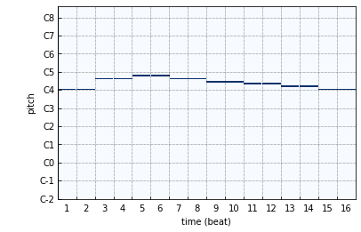
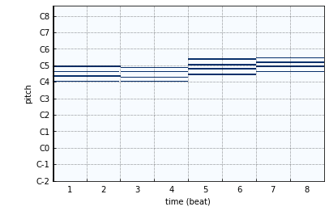

sheet
=====

Note sheet
----------

.. code-block:: python
    
    from infmidi import sheet
    txt = '''
        C4 C4 G4 G4 | A4 A4 G4 - | F4 F4 E4 E4 | D4 D4 C4 -
    '''
    melody = sheet(txt)

Chord sheet
-----------

.. code-block:: python

    from infmidi import sheet
    txt = '''
        C4:M7 A4:m7 | F4:M7 G4:7
    '''
    progression = sheet(txt)

Customize
---------
